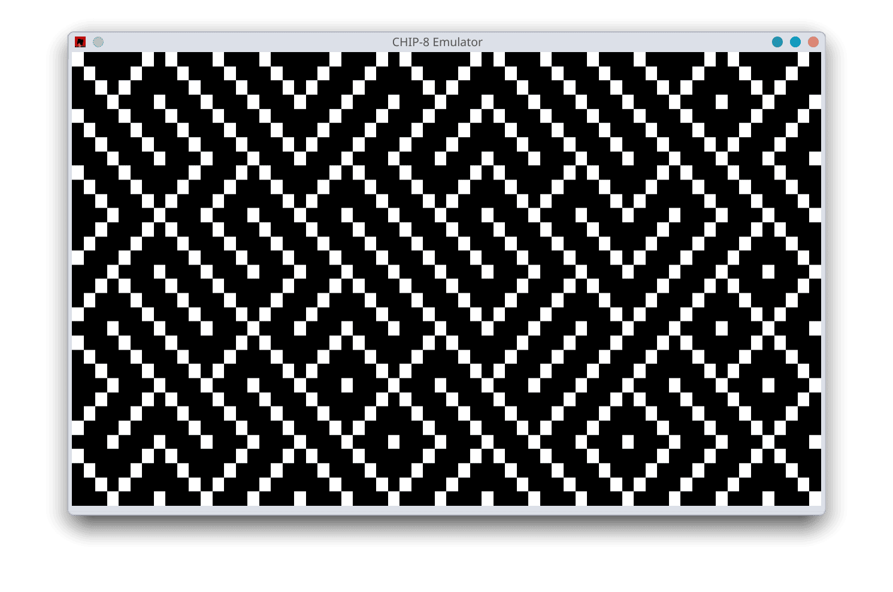

# chipster

<p align="center">
  
</p>

<p align="center">
A lightweight CHIP-8 emulator written in Rust with minimal dependencies and clean architecture.
</p>

## Motivation

I wanted to deep dive a bit more into low-level emulation in Rust and tackle a simpler project before attempting to write a Game Boy Advance (GBA) emulator.

## Performance

Since this project is focused on correctness and clarity, it only incorporates some micro-optimizations like bitwise opcode parsing.

## Key Map Translation

|                Classic CHIP-8 Keypad                |               QWERTY Keyboard Mapping               |
| :-------------------------------------------------: | :-------------------------------------------------: |
| <pre>1 2 3 C<br>4 5 6 D<br>7 8 9 E<br>A 0 B F</pre> | <pre>1 2 3 4<br>Q W E R<br>A S D F<br>Z X C V</pre> |

---

## Getting started

### Prerequisites

You need the Rust toolchain installed. If you don't have it yet, set it up via [rustup.rs](https://rustup.rs/).

### Installing and running

- Clone this repository:

```bash
git clone https://github.com/dnlzrgz/chipster
cd chipster
```

- Run a ROM by providing its file path:

```bash
cargo run --release -- "./demos/Maze (alt) [David Winter, 199x].ch8"
```

## Resources

- [Wikipedia](https://en.wikipedia.org/wiki/CHIP-8) for the high-level description of CHIP-8.
- [Chip-8 Technical Reference v1.0](http://devernay.free.fr/hacks/chip8/C8TECH10.HTM) for the detailed opcode descriptions and implementations notes.
- [Another Chip-8 Emulator (in Rust)](https://r3zz.io/posts/rust-chip8-emulator/) is the step-by-step walkthrough I mainly followed and use as inspiration.
- [Building a CHIP-8 Emulator \[C++\]](https://austinmorlan.com/posts/chip8_emulator/) is a clearer and deeper explanation.

> [!NOTE]
> The ROM in this repository have been extracted from [kripod/chip8-roms](https://github.com/kripod/chip8-roms).
